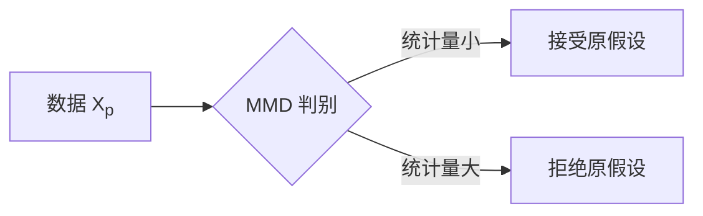

# 虚拟细胞前沿：数据饥饿与保守性崩溃

> [!IMPORTANT]
> **专栏**：Virtual Cell 前沿笔记 · 本文基于与 ChatGPT 的讨论整理，配图为原文截图。

开场先抛一个反直觉的结论：模型最缺的不是参数，而是**数据**——更准确地说，是**==数据饥饿==**与**==保守性崩溃==**之间的张力[1]。

## 为什么是 RKHS？

在讨论 MMD 之前，先看核函数的本质：$k(x, y) = \langle \phi(x), \phi(y) \rangle_{\mathcal{H}}$。注意这里的 $\phi$ 不需要显式构造。

行间公式展示 scaling law：

$$L(N) \propto N^{-\alpha}$$

化学式 H~2~O 的下标与质能方程 E=mc^2^ 的上标都支持，行内代码 `mmd(x, y)` 也不会被误伤。

> [!TIP]
> 📷 **建议插入原文 Figure 1C**：重掩码迭代过程示意图（t=0 → 0.25 → 0.5 → 1.0）。

### 主流方法对比

| 方法 | 复杂度 | 无偏性 |
|------|--------|--------|
| MMD | $O(n^2)$ | 是 |
| C2ST | $O(n)$ | 否 |

实现就三行：

```python
def mmd(x, y, kernel):
    return kernel(x, x).mean() + kernel(y, y).mean() - 2 * kernel(x, y).mean()
```

判断流程如下：



> [!WARNING]
> 该结论仅在体外实验验证，体内情况尚待确认。

配图示例（本地图片自动转 base64 内嵌）：


---

要点回顾：

- [x] RKHS 内积 ⇔ 核函数求值
- [ ] 补充体内实验证据

## 参考文献

[1] Gretton A, et al. A Kernel Two-Sample Test. JMLR, 2012.
